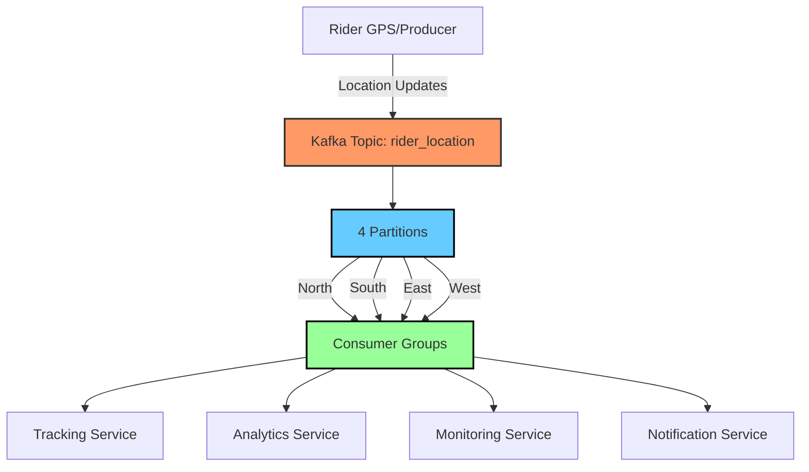

# Kafka Food Delivery System

A scalable, real-time food delivery tracking system built with Apache Kafka, demonstrating event-driven architecture for handling millions of location updates efficiently.

## System Architecture



## System Components

### 1. Producer (Rider Location Updates)
- Simulates real-time GPS updates from riders
- Sends location events to Kafka topic
- Automatically routes events to appropriate regional partition

### 2. Kafka Topic & Partitions
- Topic: `rider_location`
- 4 Partitions (North, South, East, West)
- Enables parallel processing and regional scalability

### 3. Consumer Services

#### Tracking Service
- Real-time rider location tracking
- Maintains in-memory map of current rider positions
- Updates UI in real-time

#### Analytics Service
- Processes location data for business insights
- Tracks rider distribution across regions
- Generates real-time analytics

#### Monitoring Service
- Monitors system health
- Tracks message processing rates
- Partition-wise monitoring

#### Notification Service
- Sends real-time updates to customers
- Processes location events for notifications
- Customizable notification rules

## Prerequisites
- Node.js (v14 or higher)
- Docker and Docker Compose
- npm or yarn

## Quick Start

1. **Install Dependencies**
```bash
npm install
```

2. **Start Kafka Infrastructure**
```bash
docker-compose up -d
```

3. **Initialize Services**
```bash
# Create Kafka topics
npm run admin

# Start the processor in different server
npm run processor

# Start individual services in different servers
npm run tracking-service
npm run analytics-service
npm run monitoring-service
npm run notification-service
```
